# 🎵 Spotify End-to-End Azure Data Engineering & Lakehouse Pipeline

An enterprise-grade, end-to-end Data Engineering pipeline for Spotify streaming analytics built on the **Medallion Architecture (Bronze → Silver → Gold)**. The project integrates **Azure SQL Database**, **Azure Data Factory (ADF)**, **Azure Data Lake Storage Gen2 (ADLS Gen2)**, and **Azure Databricks** with **Unity Catalog**, **Auto Loader**, **Delta Live Tables (DLT)**, and **Databricks Asset Bundles (DABs)**.

---

## 📑 Table of Contents
1. [Architecture Overview](#-architecture-overview)
2. [Tech Stack](#-tech-stack)
3. [Azure Cloud Infrastructure](#-azure-cloud-infrastructure)
4. [ADF Ingestion & Watermark CDC Engine](#-adf-ingestion--watermark-cdc-engine)
5. [Storage Tier (ADLS Gen2)](#-storage-tier-adls-gen2)
6. [Silver Layer: Auto Loader & Transformations](#-silver-layer-auto-loader--transformations)
7. [Gold Layer: Delta Live Tables & SCD Type 2](#-gold-layer-delta-live-tables--scd-type-2)
8. [Dynamic Star-Schema Querying (Jinja2)](#-dynamic-star-schema-querying-jinja2)
9. [Databricks Asset Bundles (CI/CD & Orchestration)](#-databricks-asset-bundles-cicd--orchestration)
10. [Repository Structure](#-repository-structure)
11. [Setup & Deployment Guide](#-setup--deployment-guide)

---

## 🏗 Architecture Overview

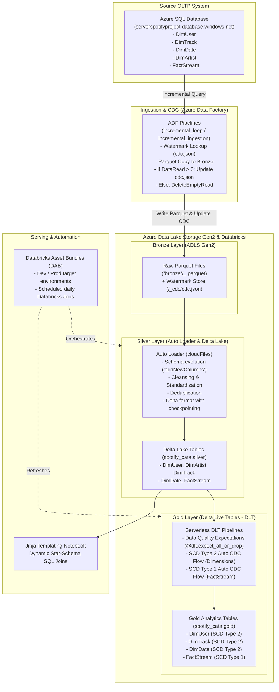

---

## 🛠 Tech Stack

* **Cloud Provider**: Microsoft Azure (`Central India`)
* **Orchestration & Ingestion**: Azure Data Factory (ADF V2)
* **Storage**: Azure Data Lake Storage Gen2 (Hierarchical Namespace enabled)
* **Compute & Processing**: Azure Databricks (Serverless Compute, Databricks Runtime)
* **Storage Engine**: Delta Lake (ACID transactions, time travel, schema enforcement)
* **Governance & Security**: Databricks Unity Catalog, Azure Managed Identity, Azure Databricks Access Connector
* **Streaming & Ingestion**: Databricks Auto Loader (`cloudFiles`)
* **Declarative Pipelines**: Delta Live Tables (DLT) with SCD Type 1 & Type 2 Change Data Capture
* **CI/CD & DevOps**: Databricks Asset Bundles (DAB), UV package manager, Git

---

## ☁️ Azure Cloud Infrastructure

All services are deployed with secure connectivity, managed identities, and centralized access controls.

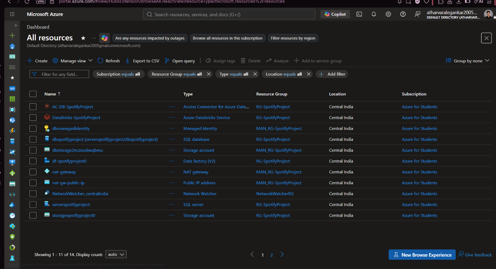

| Resource | Type | Purpose |
| :--- | :--- | :--- |
| `AC-DB-SpotifyProject` | Access Connector for Azure Databricks | Grants Databricks Unity Catalog managed identity access to ADLS Gen2 |
| `DataBricks-SpotifyProject` | Azure Databricks Service | Unified analytics platform executing Auto Loader and DLT pipelines |
| `serverspotifyproject` | Azure SQL Server | Host server for the source database |
| `dbspotifyproject` | Azure SQL Database | OLTP source database containing raw Spotify streaming records |
| `storagespotifyproject0` | Storage account (ADLS Gen2) | Primary Data Lake storing `bronze`, `silver`, `gold`, and `databricksmetastore` |
| `df-spotifyproject0` | Data Factory (V2) | Serverless ETL orchestrator managing watermark CDC extraction |

---

## 🔄 ADF Ingestion & Watermark CDC Engine

The ingestion tier handles **high-watermark Change Data Capture (CDC)** to extract only modified or newly created rows from Azure SQL Database.

### 1. Master Pipeline: `incremental_loop`
Iterates sequentially over all 5 data entities (`DimUser`, `DimTrack`, `DimDate`, `DimArtist`, and `FactStream`).


### 2. Parameterized Worker: `incremental_ingestion`
1. **Lookup (`last_cdc`)**: Retrieves the latest watermark timestamp from `bronze/<table_name>_cdc/cdc.json`.
2. **Variable (`current`)**: Captures current execution time using `@utcNow()`.
3. **Copy Data (`AzureSQLToLake`)**: Runs:
   ```sql
   SELECT *
   FROM @{pipeline().parameters.schema}.@{pipeline().parameters.table}
   WHERE @{pipeline().parameters.cdc} > '@{activity('last_cdc').output.value[0].cdc}'
   ```
4. **Conditional Guard (`ifIncrementalData`)**:
   * **If `dataRead > 0`**: Runs `MaxCDC` (`SELECT MAX(<cdc_col>)`) and copies the new watermark value into `bronze/<table_name>_cdc/cdc.json`.
   * **If `dataRead == 0`**: Executes `DeleteEmptyRead` to eliminate empty files created during zero-row runs.


### 3. Execution & Validation
Live execution demonstrates zero-byte cleanup in action during iterations where no new records were inserted:


Pipeline execution completes successfully across all loop iterations:


---

## 💾 Storage Tier (ADLS Gen2)

### 1. Containers Hierarchy
Storage is partitioned into Medallion tiers along with the Unity Catalog metastore root:

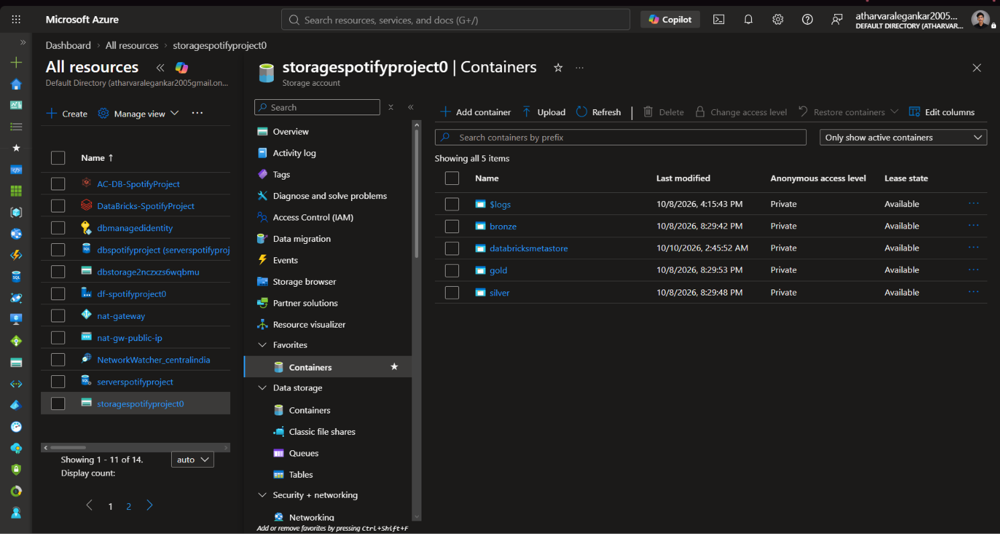

* `bronze`: Landed raw Parquet batches and watermark files.
* `silver`: Delta Lake table storage and Auto Loader checkpoint directories.
* `gold`: Business-level curated tables.
* `databricksmetastore`: Managed metastore storage for Unity Catalog.

### 2. Bronze Directory Structure
Each table has a dedicated data landing folder alongside an isolated `_cdc` watermark directory:

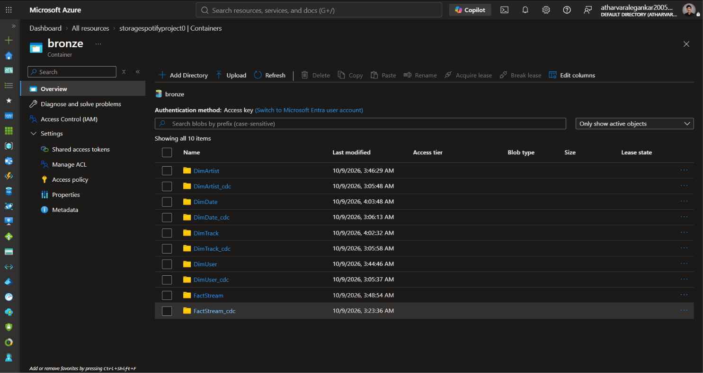

### 3. CDC Watermark Persistence
Watermarks are stored in JSON format, updated atomically using a template `empty.json` and `additionalColumns`:

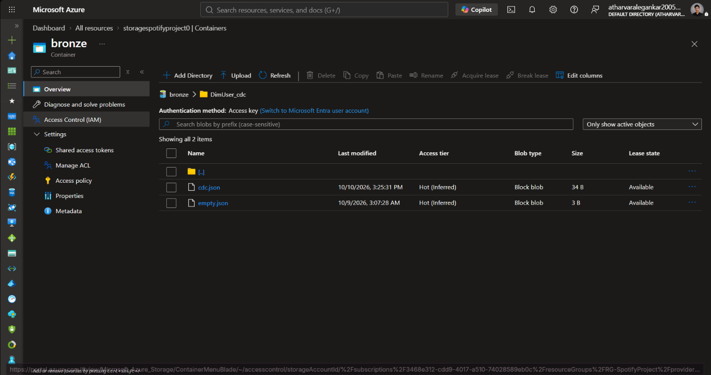

### 4. Timestamped Batch Files
Each extraction batch generates an immutable, timestamped Snappy Parquet file:

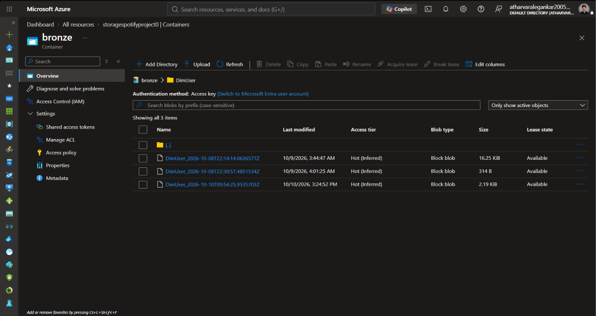

---

## 🥈 Silver Layer: Auto Loader & Transformations

The Silver tier processes bronze data using **Databricks Auto Loader (`cloudFiles`)** with automatic schema inference, schema evolution (`addNewColumns`), and checkpointing.

```python
df_user = spark.readStream.format("cloudFiles") \
    .option("cloudFiles.format", "parquet") \
    .option("cloudFiles.schemaLocation", "abfss://silver@storagespotifyproject0.dfs.core.windows.net/DimUser/checkpoint") \
    .option("schemaEvolutionMode", "addNewColumns") \
    .load("abfss://bronze@storagespotifyproject0.dfs.core.windows.net/DimUser/")
```

### Unity Catalog Managed Silver Tables
All tables are cataloged under `spotify_cata.silver`:

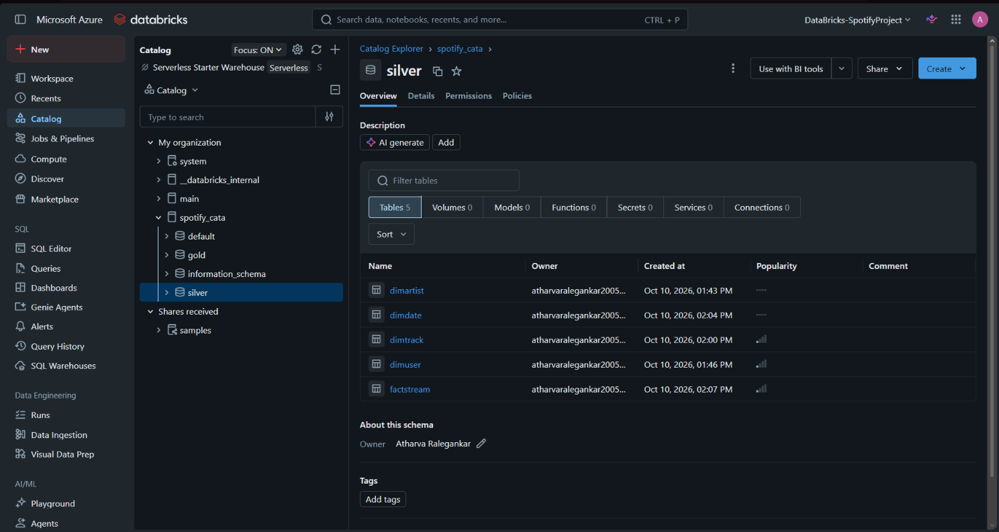

### Transformations Applied:
* **`DimUser`**: Name normalization to uppercase (`upper(col("user_name"))`) and removal of `_rescued_data`.
  
  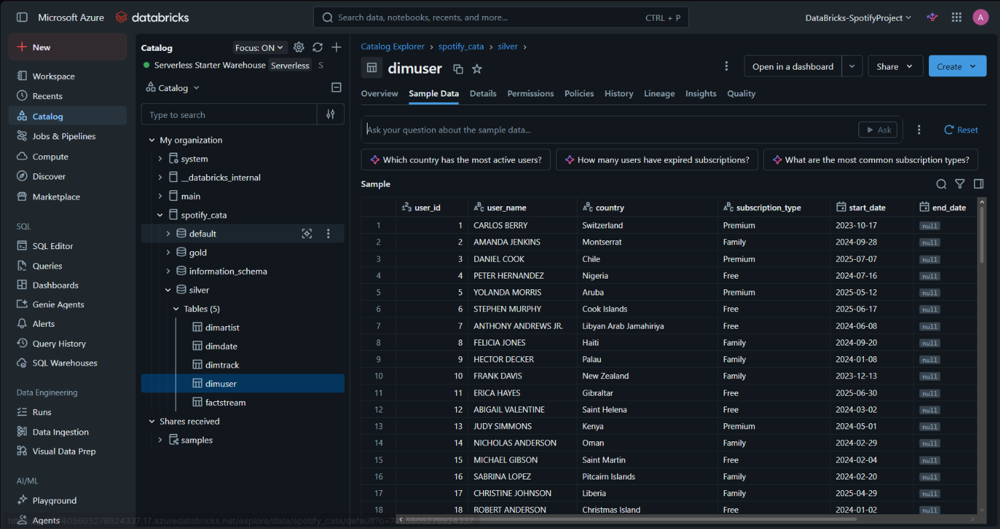

* **`DimArtist`**: Deduplication on primary key (`dropDuplicates(['artist_id'])`).
  
  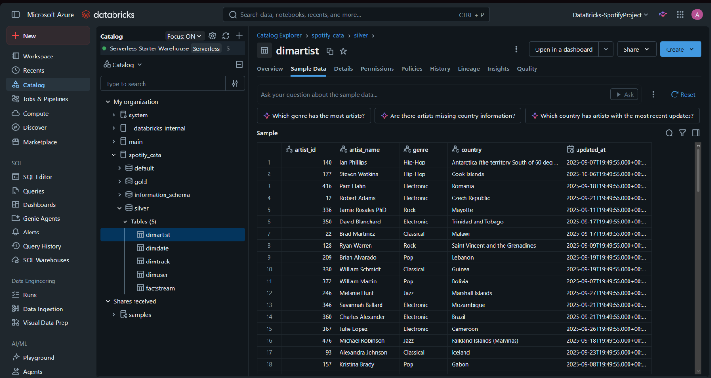

* **`DimTrack`**: Categorization into duration flags (`<150s` low, `<300s` medium, else high) and track name punctuation cleaning (`regexp_replace(col('track_name'), '-', '')`).
  
  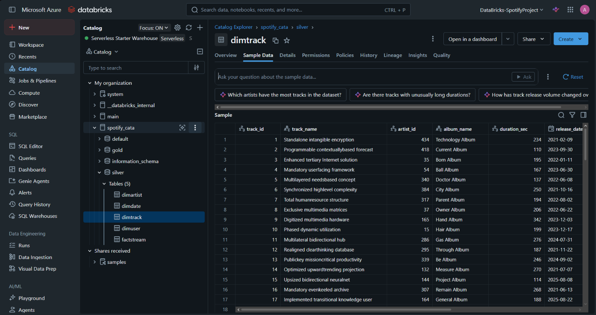

* **`DimDate`**: Calendar dimension for analytical slicing and aggregations.
  
  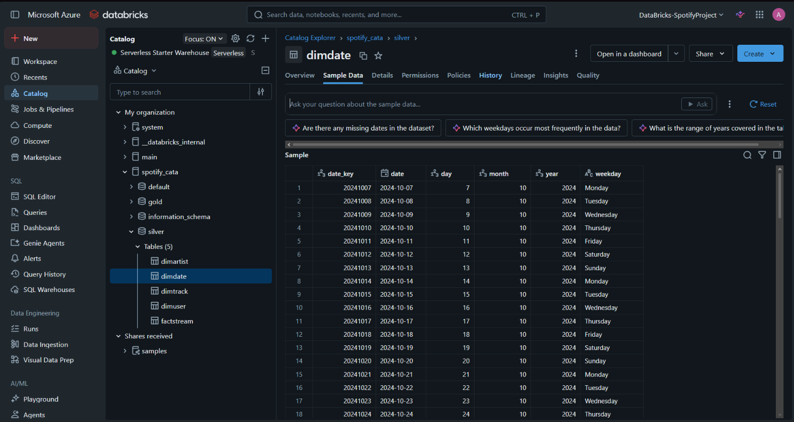

* **`FactStream`**: Streaming event fact table recording `stream_id`, `user_id`, `track_id`, `date_key`, `listen_duration`, `device_type`, and `stream_timestamp`.
  
  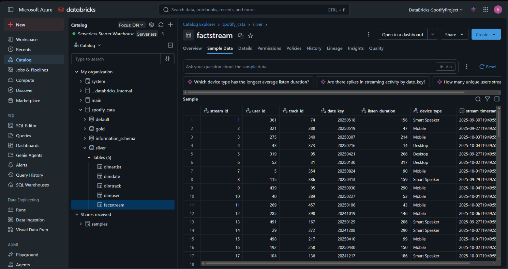

---

## 🥇 Gold Layer: Delta Live Tables & SCD Type 2

The Gold tier runs on **Serverless Delta Live Tables (DLT)** configured via `spotify_dab_etl.pipeline.yml`:

### 1. Data Quality Expectations
Data hygiene is enforced using declarative constraints:
```python
@dlt.table(comment="Cleansed staging layer for dimuser")
@dlt.expect_all_or_drop({"rule_1": "user_id IS NOT NULL"})
def dimuser_stg():
    return spark.readStream.table("spotify_cata.silver.dimuser")
```

### 2. Slowly Changing Dimensions (SCD Type 2)
Dimensions preserve full historical changes automatically tracking validity intervals (`__START_AT`, `__END_AT`):
```python
dlt.create_streaming_table(
    name="dimuser",
    comment="Final Gold SCD Type 2 User Dimension Table"
)

dlt.create_auto_cdc_flow(
    target = "dimuser",
    source = "dimuser_stg",
    keys = ["user_id"],
    sequence_by = col("updated_at"),
    stored_as_scd_type = 2
)
```

### 3. Fact Table CDC (SCD Type 1)
`FactStream` is managed via **SCD Type 1** upsert on `stream_id`, sequenced by `stream_timestamp`.

---

## 🧩 Dynamic Star-Schema Querying (Jinja2)

Located in [jinja_notebook.py](file:///d:/databricks/AzureSpotifyPipeline/spotify_dab/spotify_dab/src/jinja/jinja_notebook.py), dynamic SQL templates generate join queries between `FactStream` and multiple dimension tables on the fly:

```python
from jinja2 import Template

parameters = [
    {
        "table": "spotify_cata.silver.factstream",
        "alias": "factstream",
        "cols": ["factstream.stream_id", "factstream.listen_duration"]
    },
    {
        "table": "spotify_cata.silver.dimuser",
        "alias": "dimuser",
        "cols": ["dimuser.user_id", "dimuser.user_name"],
        "conditions": "factstream.user_id = dimuser.user_id"
    },
    {
        "table": "spotify_cata.silver.dimtrack",
        "alias": "dimtrack",
        "cols": ["dimtrack.track_id", "dimtrack.track_name"],
        "conditions": "factstream.track_id = dimtrack.track_id"
    }
]
```

---

## 🚀 Databricks Asset Bundles (CI/CD & Orchestration)

The project leverages **Databricks Asset Bundles (DAB)** for infrastructure-as-code and environment parity across development and production.

### Target Environments:
* **`dev`**: Sandbox deployment with developer-prefixed resources and paused triggers.
* **`prod`**: Production deployment mapped to `/Workspace/Users/.../PROD/.bundle/` with strict RBAC permissions.

### Automated Databricks Job:
Configured in [sample_job.job.yml](file:///d:/databricks/AzureSpotifyPipeline/spotify_dab/spotify_dab/resources/sample_job.job.yml) to execute daily:
1. `notebook_task`: Runs dimension staging notebook.
2. `python_wheel_task`: Executes packaged transformation wheels.
3. `refresh_pipeline`: Triggers serverless DLT pipeline refresh.

---

## 📁 Repository Structure

```text
AzureSpotifyPipeline/
├── dataset/                               # ADF Dataset definitions
│   ├── json_dynamic.json                  # Dynamic JSON dataset for CDC storage
│   ├── parquet_dynamic.json               # Dynamic Parquet dataset for Bronze landing
│   └── sqlspotifyproject.json             # Azure SQL source dataset
├── linkedService/                         # ADF Linked Services
│   ├── dlspotifyproject.json              # ADLS Gen2 connection
│   └── sqlspotifyproject.json             # Azure SQL DB connection
├── pipeline/                              # ADF Pipeline templates
│   ├── incremental_ingestion.json         # Parameterized child ingestion pipeline
│   └── incremental_loop.json              # Master iterative orchestration pipeline
├── images/                                # Architectural & execution screenshots
│   ├── RG_RESOURCES.png                   # Azure Portal resources
│   ├── df/                                # ADF execution & canvas screenshots
│   ├── StorageAccount/                    # ADLS Gen2 containers & bronze layout
│   └── silver/                            # Databricks Unity Catalog & table views
└── spotify_dab/                           # Databricks Asset Bundle (DAB)
    └── spotify_dab/
        ├── databricks.yml                 # DAB bundle definition (dev & prod)
        ├── resources/
        │   ├── sample_job.job.yml         # Daily scheduled Databricks Workflow
        │   └── spotify_dab_etl.pipeline.yml # Serverless DLT pipeline spec
        ├── src/
        │   ├── silver/
        │   │   └── silver_Dimensions.py   # Auto Loader Silver streaming ETL
        │   ├── gold/gold_pipeline/transformations/
        │   │   ├── DimUser.py             # DLT SCD Type 2 for DimUser
        │   │   ├── DimTrack.py            # DLT SCD Type 2 for DimTrack
        │   │   ├── DimArtist.py           # DLT transformations for DimArtist
        │   │   ├── DimDate.py             # DLT SCD Type 2 for DimDate
        │   │   └── FactStream.py          # DLT SCD Type 1 for FactStream
        │   └── jinja/
        │       └── jinja_notebook.py      # Dynamic Jinja2 Star-Schema querying
        └── utils/
            └── transformations.py         # Reusable PySpark transformation classes
```

---

## 🏁 Setup & Deployment Guide

### 1. Prerequisites
* Azure CLI authenticated (`az login`)
* Databricks CLI (`>= 0.200.0`)
* Python 3.10+ & Astral UV (`uv`)

### 2. Configure Databricks CLI
```bash
databricks configure --host https://adb-7405605278924337.17.azuredatabricks.net
```

### 3. Deploy Databricks Asset Bundle
To deploy to the **Development** workspace:
```bash
cd spotify_dab/spotify_dab
databricks bundle deploy --target dev
```

To deploy to **Production**:
```bash
databricks bundle deploy --target prod
```

### 4. Run Job or Trigger DLT Pipeline
```bash
databricks bundle run
```
